# WEEK 2

## Overview

* Share Inspiring Projects
* Electricity (Review)
* Components
* Fritzing
* Research Groups

## Project Share (Volunteers)

* Share some of the project that you find inspiring with the class
* Ask questions of your classmates; give feedback; be critical and supportive!
	* How does it work?
	* I'd like to build this with you!
	* This makes me think of...
	* What problem does this solve?
	* Can this be used to solve a problem?
	* What problems does this create?
	* What ideas do you like too?
	* What scares you about the project.

## Electricity

Super basic review. Please stop me if you don't understand. It's a crucial foundation for getting inside the minds of robots.

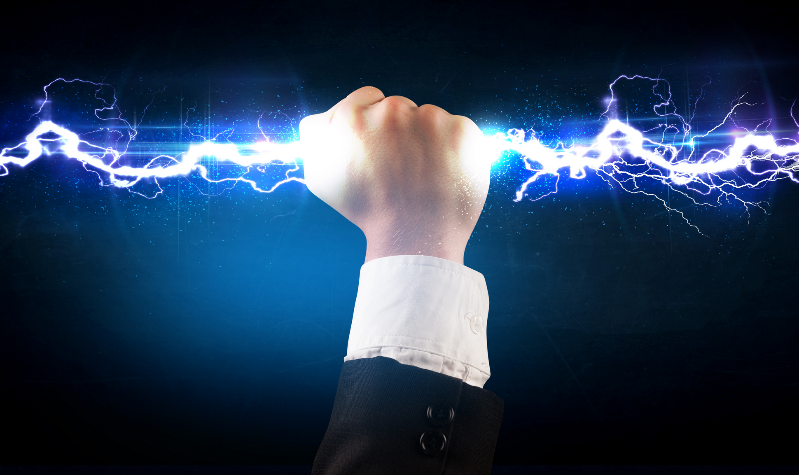

### What is it?

Electricity is the class of phenomena that involve the presence and movement of electric charge. It makes electronics work.

### What is Electric Charge?

Electric charge is a physical property of matter

Spectrum of charge from positive to neutral to negative

Opposite charges attract

### Electrons and Protons

These are subatomic particles that possess charge.

* Electrons are negatively charged
* Protons are positively charged

Atoms with an equal number of protons and electrons have a **net zero** charge. They _appear_ neutral but can easily be polarized in the presence of nearby charges or electro-magnetic fields.

### Electromagnetic Fields

Charges produce and interact with electric and magnetic (electromagnetic) fields.

[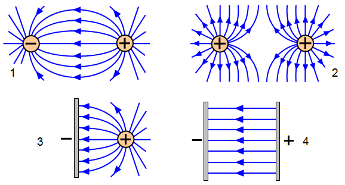](http://www.schoolphysics.co.uk/age11-14/Electricity%20and%20magnetism/Electrostatics/text/Electric_fields/index.html)

Magnetic fields are produced by moving charges. Changing magnetic fields cause charged particles to experience force.

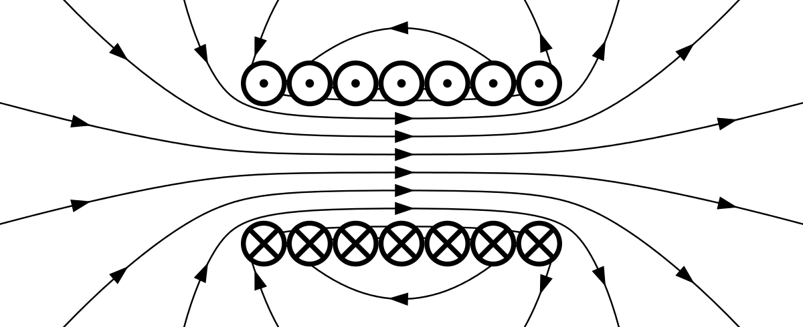

### Power Sources and Voltage

	
#### Voltage

To create electricity that we use in our electronics, we need to somehow harness the forces of nature to get electrons to do our bidding.

Voltage is the potential energy within a system that compels charges to move.

* Presence of Electric Fields (other charged particles)
* Chemical Reactions
* Magnetic Fields
* Photoelectric, Piezoelectric, Thermoelectric Effects

#### Electric Fields

Polarization happens to an object (collection of atoms) when in the presence of an electric field strong enough to push its electrons around. Friction between certain materials can cause electrons to be stripped from one object and collect on the other.

[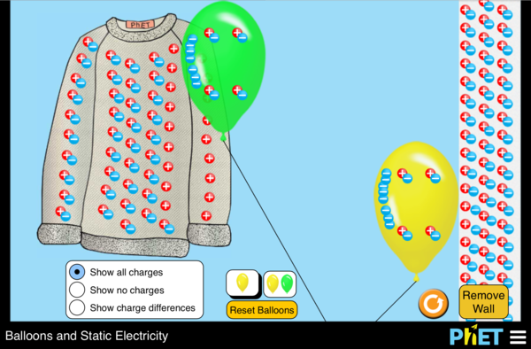](https://phet.colorado.edu/en/simulation/balloons-and-static-electricity)

This same principle produces lighting. It's difficult to harness as is, but electric fields are what enables capacitors to store and release charge. More on this later!

#### Chemical Reactions

Molecules are arrangements of atoms that hook up based on their charge distribution. All chemical reactions involve electro-chemical interactions, which means charges are moved or rearranged. By forcing chemical reactions to occur in a certain way, we can harness the electro-chemical energy and get it to do work for us. This is how batteries work.

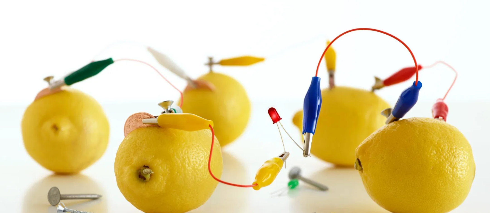

#### Magnetic Fields

By moving a coil of wire in and out of a magnetic field, we can induce current to flow. This is because the electrons in the wire experience a force when subjected to a changing magnetic field. This principle is the primary means used to convert mechanical energy into electricity.

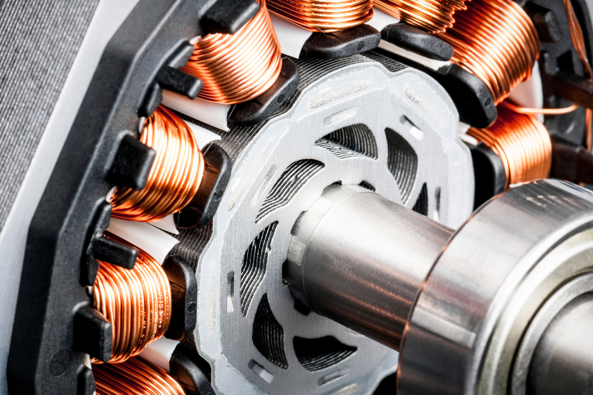

Coils like this can be found in alternators in vehicles, wind turbines, hydro electric generators, dynamos that power bike lights, and in nuclear facilities! These are typically fitted to turbines in power plants of all kinds, even geothermal:

Yes, some [motors can be used to generate charge](https://blog.voltaicsystems.com/make-a-dynamo-to-charge-your-phone/) too!

### Current

Simply, the movement of charge.

* Positive convention views charge as flowing from positive to negative.
* Movement of electrons is actually OPPOSITE positive convention.
* Particles don't actually move much, but their forces do...

Like this...

Less like this...

Sometimes like...

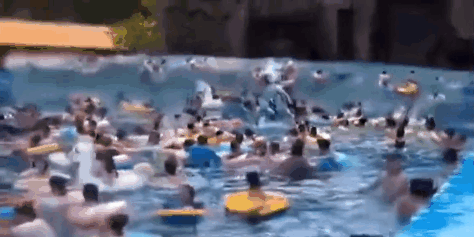

#### Analogies

The way electric current flows through a circuit is sometimes explained by analogy, relating it to concepts in fluid dynamics

* Water pressure
* Air pressure

What these both attempt to capture is the idea of potential energy stored in a system, and the movement of that energy as current represented by some sort of fluid. These are helpful and we'll dig into these a bit more later.

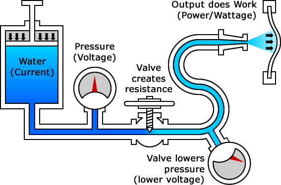

### Direct vs Alternating

Power supplies typically have at least two terminals. Depending on how the power is being generated and conditioned, these terminals might have different meanings.

### Direct Current (DC)

The current direction is static and flows from the **Positive** terminal to the **Negative**. We're going to first focus on DC circuits.

### Alternating Current(AC)

The direction of the current alternates and the two terminals are not fixed positive `+` and negative `-` but might be labelled as hot and neutral as in mains power outlets. They might simply be labelled as `~` and `~` to indicate that it is an alternating power source.

## DC Circuits

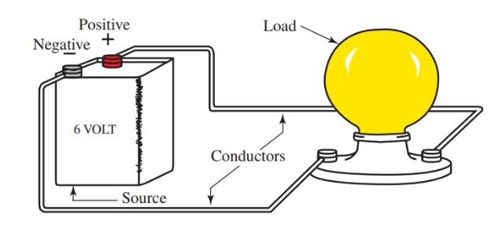

A closed loop or network of paths where electric energy is made to do work.

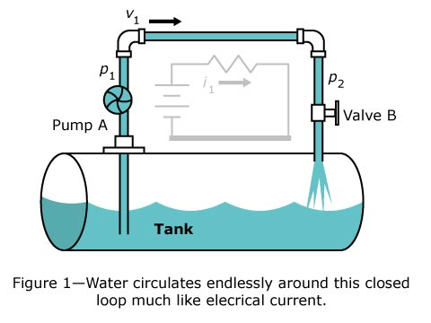

### Basic Concepts

A Circuit needs a power source, a source of **Voltage** or potential energy to compel charges to move. Power sources have positive and negative connections for 

A Circuit also needs a close path for charges to move along. This path has some **Resistance** to the flow of current.

The current that flows through the circuit is dependent upon the amount of **Voltage** and **Resistance**

### Ohm’s Law

Ohm's Law describes the basic relationship of three different elements in an electronic circuit.

* Voltage (Volts) - amount of motivation for charges to move
* Current (Amps) - the actual amount of charges on the move
* Resistance (Ohms) - the ability for the circuit to allow for charges to move

## Components and Schematic Symbols

* **Battery** - AKA Electromotive Force
* **LED** - Light Emitting Diode
* **Resistor** - Current limiter
* **Switch** - Makes or Breaks a circuit

[source](https://www.build-electronic-circuits.com/schematic-symbols/)

### Battery (DC power supply)

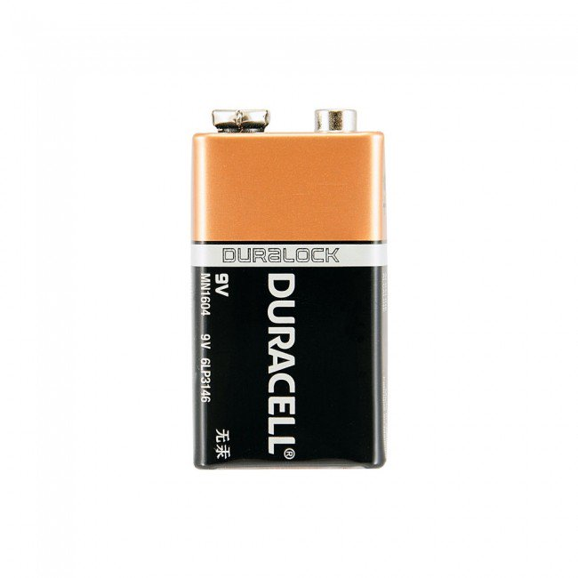

### LED Light Emitting Diode

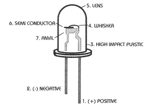

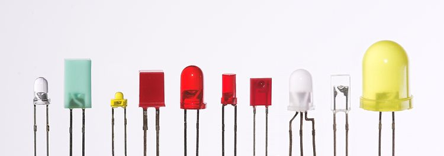

### Resistor

### Switch

## Series vs Parallel Circuits

### Series

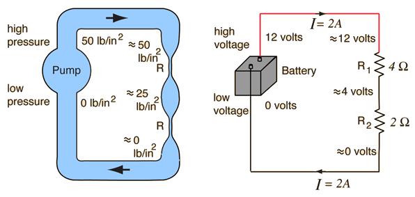

### Parallel

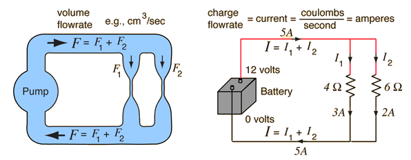

### Work and Power

When work is done in a circuit, energy is dissipated. Power measures how much energy was dissipated. We use it to describe the amount of electricity we need to operate certain components. We'll get into this a bit later when working with high current applications.

But, just so we have it, here is the expanded version of ohm's law that takes into consideration power or wattage:

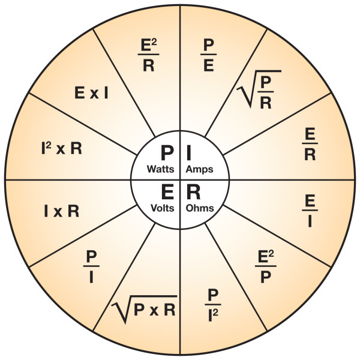

## Assignment 2

* Build a series circuit + Build a parallel circuit
* Create a custom switch built from novel materials
* Draw the circuit diagrams of your projects
* Publish Documentation to Medium
* Create a Journal entry that chronicles the research you're doing in other classes that you want to connect to this class. Record some of the thoughts and ideas you have about physical computing, what you might want to work on, what thoughts you have about the idea of making things "smart".

## External Links

* [Play-Hookey](http://www.play-hookey.com/) - a primitive, but very informative site to learn electronics.