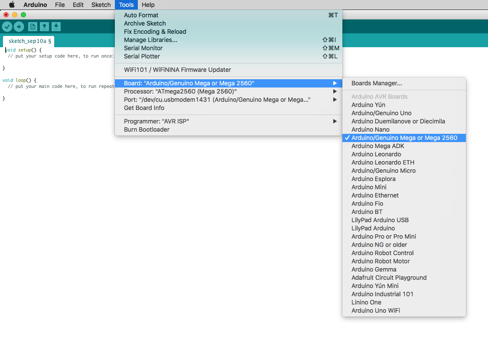
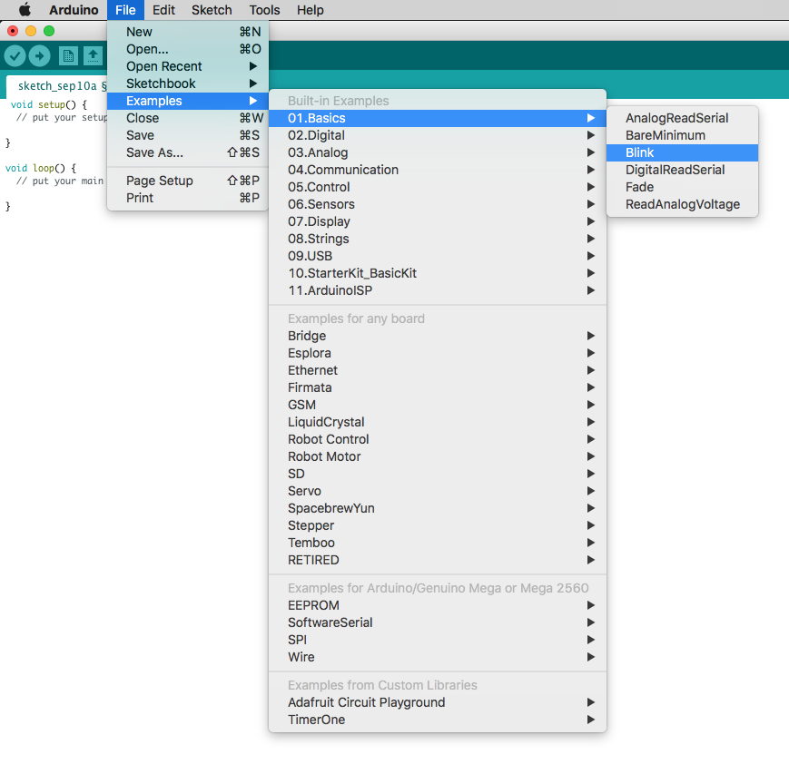
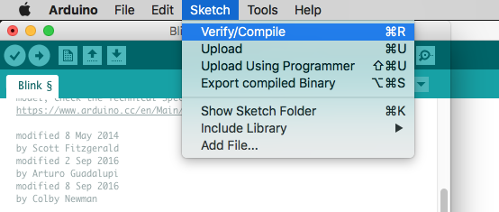
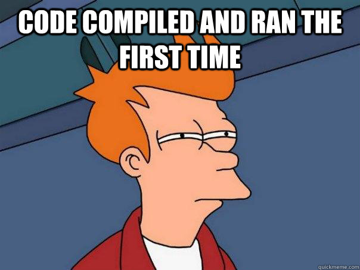
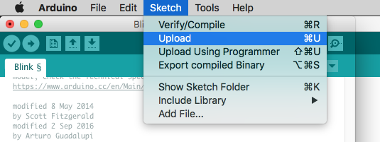

# WEEK 3

## Overview

* Pop Quiz
* Arduino
	* How to help yourself
	* Coding Principles
	* Timing
	* Input / Output
* Lab
* Think Tank: Towards a new Definition of Smart

## Pop Quiz

[Quiz 1 (week 3)](https://docs.google.com/forms/d/e/1FAIpQLSePByKVqd-1X0NQh08DovacXF2xnJoDllqtSiAt64yAK-LVYQ/viewform?usp=pp_url)

# Arduino Intro

[**USE THE REFERENCE**](https://www.arduino.cc/reference/en/) - it has everything you need to know to get started and past your initial hurdles!!! *I refer back to it constantly.*

Arduino is a system that allows for the development of software for microcontrollers, the brains of physical computing projects. When we want a microcontroller to perform a particular task, we have to write software that reads inputs, performs some calculations, and changes output. The code has to be uploaded onto the device.

Arduino is an integrated development environment that allows for all of this to happen using one application.

## Startup

When you launch Arduino, you'll be presented with the default "bare minimum" sketch.

Arduino is an integrated development environment (IDE):

* color coded text editor
* compiler
* uploader
* debugger
* examples
* library management
* hardware presets


Arduino projects are called sketches. When you save them, the are placed in their own folder of the same name. This actually helps keep your file system tidy and easy to navigate. Embrace it.

## Board Settings

The Arduino IDE automatically compiles code based on the board and processor combination. We need to tell the IDE which board and processor we're using.



Arduino also needs to know where your'e connecting the board. The port specification tells the IDE where to look for the board. USB, Bluetooth, WiFi or some other port. We'll generally be using USB.


## Hello World!

A "Hello World" program is a simple program that tests basic output. In the case of physical computing systems, that includes a hardware output: a blinking LED. The "Blink.ino" example is just this.

You can find it in the examples section:



Have a look at the code. Can you tell what it does?


## Uploading

When we are ready to upload our code, first we run a quick verification to quick catch any errors. We're going to make mistakes. That's just a part of coding.



The console output will display the process and any errors, if present...


Hmm...



J/K it's fine! Let's upload it.



\*crosses fingers\*


**SUCCESS!**

## Common Errors When Uploading

Board got disconnected:


Wrong board or processor selected:


# Coding Basics

## Arduino Code Structure

Arduino is essentially a Java based programming environment. Arduino projects are called sketches. The bare minimum for a sketch is the following code:

```
/*
Comment Blocks at the top of your program let others know what it does.
These can contain multiple lines.
*/

// these are in line comments

void setup(){ // runs once at startup
}

void loop(){ // runs continuously
}
```

These are functions, blocks of code that executed by a higher level framework that we don't have access to.

The way code is typed, the order of symbols is referred to as syntax. The syntax of the structures we see in the bare minimum are **function definitions.**

We define a function in order to **call** upon its functionality using its name. When we define a function we need to declare

* what **data type** it returns
* its **name**
* what kinds of **arguments** it expects between `()`
* the **code** that is executed between `{}`

## Syntax

Let's focus on what goes in between the `{}`

We organize code into lines. Each separate line that is a different instruction must be terminated with a semicolon `;`.

Take a look at a stripped down version of the Blink example:

```
void setup() {
  pinMode(LED_BUILTIN, OUTPUT);
}

void loop() {
  digitalWrite(LED_BUILTIN, HIGH);
  delay(1000);
  digitalWrite(LED_BUILTIN, LOW);
  delay(1000);
}
```

* How many instructions are written?
* What are some of the functions used in this example?


## Data Types

Everything in the world of computers is represented by a number. Even text is represented as a number. When we instruct a computer to work with data, we need to tell it how it should treat the data we want it to process. We use **data types** to do so.

Some basic data types (this list is *not* exhaustive):

* `boolean`: boolean is either `true` or `false`, but can hold `1` or `0` too.
* `int`: integers are positive and negative whole numbers 
* `float`: floating point numbers have decimal points
* `byte`: 8 bits of data
* `char`: an [ASCII](https://www.arduino.cc/en/Reference/ASCIIchart) character, stored as a number.
* `String`: essentially an array of chars... [but a little more complicated](https://www.arduino.cc/reference/en/language/variables/data-types/stringobject/)

## Constants and Variables

When working with data types, we need places to store the data. Constants and Variables are just what we use to do this.

### Variables

These are containers of data whose contents can change as our program runs.

To declare a variable we need to specify its type and then give it a name. We can either initialize it on the spot or in the setup. Check it out:

```
//globally declared and initialized
int var_1 = 42;
int var_2;

void setup(){
	var_2 = 123;
}

void loop(){
	int var_3; // declares var_3 in the loop() local scope
	var_3 = var_2 + var_1;
}
```

A note of scope: where a variable is declared determines its scope, or what functions have access to it.

* Global variables are declared in the same scope as `setup()` and `loop()`.
* Variables declared inside `setup()` are local to `setup()` and not accessible to `loop()` or any code outside of the `setup()` function.

### Constants

These containers can't be written to, they are read-only, hence, constant. They obey scope just like other variables, which can be advantageous when compared with definitions (see below).

### Definitions

Definitions are a way of defining a string of text in your code to be interpreted as a value at the compiler level. It's way to save memory space when it becomes limited, but you must be careful!

Here's an example:

```
#define LED_1 13
```

Any instance of the text "LED_1" in your code will be interpreted as the integer 13 by the compiler. This is different that assigning memory space on the microcontroller to hold the value 13.

## Functions

You can define functions of your own! You'd want to do this when you have several lines of code that you reuse again and again in different places. You can replace this with a **function call**.

Have a look at this modified Blink example:


```
boolean led_state = false; // declare and define a variable to hold the state of the LED

void setup() {
	  pinMode(LED_BUILTIN, OUTPUT);
}

void loop() {
	toggleLED(); // this is a call to the function "toggleLED"
}

// function definition for "toggleLED"
void toggleLED(){
	digitalWrite(LED_BUILTIN, led_state); // write the led_state to the output pin
	led_state = !led_state; // toggle the led_state
	delay(1000); // wait 1 second
}
```

## Arrays

When dealing with a lot of different items, say 20 LEDs, all blinking at different rates, it doesn't make sense to create 20 different variables for each one.

You should use an array to store the different delay times or on-off states. Each item in an array is an **array element**. Each one has an address representing its location or position in the array. **array elements** are indexed using this address.

```
const int qty_leds = 10; // how many LEDs we are controlling
boolean led_states[10]; // an array that holds the states initialized to all zeros by default
// this is how we initialize an array with specific values
int led_intervals[] = { 100,
                        200,
                        300,
                        400,
                        500,
                        600,
                        700,
                        800,
                        900,
                        1000
                      }; // don't forget the semicolon!!!

void setup() {
}

void loop() {
}

```

To access the value of an **array element** use the square brackets `[]`. The name of the array followed by the `[]` containing the index, will return the value of the indexed element in that array.

What is the value of x?

```
int x = led_intervals[3];
```

Hint: indexes start at 0 and end at the number of elements in the array, n, minus 1.

## For Loops

Now that we're using arrays, we want to be able to index them sequentially, not using code that looks like this:

```
digitalWrite( led_pin_1, led_state[0] );
digitalWrite( led_pin_1, led_state[1] );
digitalWrite( led_pin_1, led_state[2] );
digitalWrite( led_pin_1, led_state[3] );
digitalWrite( led_pin_1, led_state[4] );
digitalWrite( led_pin_1, led_state[5] );
digitalWrite( led_pin_1, led_state[6] );
digitalWrite( led_pin_1, led_state[7] );
digitalWrite( led_pin_1, led_state[8] );
digitalWrite( led_pin_1, led_state[9] );
```

but like this:

```
for( int i = 0; i < 10; i++){
	digitalWrite( led_pin_1, led_state[i] );
}
```

Let's break that down:


```
// looks like a function!
for(){
}

```

```
for( int i = 0; i < 10; i++ ){
}

// "int i = 0; i < 10; i++" is an argument that look a lot like lines of code:

int i = 0; // declares a an integer named "i" and initializes it to 0
i < 10; // this is a comparison that checks if the value of "i" is less than 10, if so, keep looping!
i++ // each loop, we increment the value of "i"
```

```
for( int i = 0; i < 10; i++){
	// what's the value of "i" when we start?
	// what about on the second pass?
	digitalWrite( led_pin_1, led_state[i] ); // we can use "i" to index the array
}
```

## Evaluative Statements, Conditions, Boolean

When we want a program to do XYZ when ABC happens, we need to set up a condition to evaluate. There certain structures in programing called **evaluative statements**. These statements **involve operators**. Like addition and subtraction are arithmetic operators that manipulate numbers, **boolean operators** allow us to compare logical **conditions** in a number of different ways.

* `true` - is a boolean value that corresponds to the integer `1` and a voltage, typically great than half the supply voltage, or `HIGH`.
* `false` - is a boolean value that corresponds to the integer `0` and a voltage, typically less than half the supply voltage, but ideally zero, or `LOW`.
* **not** `!` - inverts a boolean value, converting `true` to `false` and visa versa
	* `!true` = `false`
	* `!false` = `true`
* **equals** `==` - returns whether too boolean values are equal
	* what does `true == false` evaluate to?
	* what does `(true == false) == false` evaluate to?
* **or** `||` - evaluates to true when one of the conditions is true
* **and** `&&` - evaluates to true when **both** conditions are true
* **exclusive or** `^` - evaluates to true only when the conditions are different
* **greater than** `>`
* **greater than or equal to** `>=`
* **less than** `<`
* **less than or equal to** `<=` 

## if / elseif / else

We can use evaluative statements to control the flow of our code. **If statements** are a key tool for doing this.

```
int a;
int b;

void setup(){
	a = 37;
	b = 0;
	pinMode(LED_BUILTIN, OUTPUT);
}

void loop(){
	if ( a < b ) {
		digitalWrite(LED_BUILTIN, LOW);
	} else {
		digitalWrite(LED_BUILTIN, HIGH);
	}
	
	if ( b >= b++;
	
	delay(1000);
}	

```

## Inputs and Outputs

### Inputs

**pinMode()** - is used to tell the board whether the pin is an input or output

* declared in `setup()`
* requires two arguments:
	* the pin number
	* whether it is an `INPUT`, `OUPUT`, `INPUT_PULLUP`

```
void setup(){
	pinMode(LED_BUILTIN, OUTPUT);
}
```

**digitalRead()** - is used to read the logical value of the specified pin

* returns either a `true` or `false`
* requires one argument:
	* the pin number on the Arduino board

```
int the_pin;

void setup(){
	the_pin = 8;
	pinMode(the_pin, INPUT);
}

void loop(){
	boolean pin_state = digitalRead(the_pin);
}
```

### Outputs

**digitalWrite()** - used to write boolean values to the output pin

* output is either on or off `HIGH` or `LOW`, `true` or `false`, `1` or `0`
* requires two arguments:
	* the pin number
	* the boolean state to write to the pin

We've seen enough examples of this already ;)

## Lab Exercises

* Load 'Blink' example to your board
* Modify the 'Blink' example in the following ways
	1. Make it blink slower
	2. Make it blink faster
	3. Add a routine that makes it blink when you close a switch
	4. Modify the routine so that it blinks one speed when one switch is closed and a different speed with another switch is closed

## Timing Tricks

### delay()

Delay pauses all code on your Arduino. There's an exception for interrupts, which we'll cover later, but this can pose problems for actions that need to have independent timing...

### millis()

In order to get around this, we can create timer like mechanisms. For this we need to:

* have a place to temporarily store the **current time**
* a place to hold the **last time** the loop completed
* a place to hold a value representing **time elapsed** or **duration** between the events we are triggering, an **interval**.

```
long last_time; // **last time**
int interval; // **interval**
boolean led_state;

void setup(){
	last_time = 0;
	interval = 1000;
	led_state = false;
	pinMode(LED_BUILTIN, OUTPUT);
}

void loop(){
	long current_time = millis(); // **current time** read at the start of the loop
	if( current_time - last_time > interval ){ // we then compare the elapsed time with the interval
		toggleLED();
		last_time = current_time; // store the current time as the last time the event was triggered
	}
}

void toggleLED(){
	digitalWrite(LED_BUILTIN, led_state);	led_state = !led_state;
}

```

## Research Groups

[Research Presentation Topics](../../resources/research.md)

* **Group 1** - presents week 5 - Design Principles
	* Akshay
	* Dylan
	* Wenjun
* **Group 2** - presents week 7
	* Steven
	* Billy
	* Franzi
* **Group 3** - presents week 10
	* Ashley
	* Theresa
	* Julia
* **Group 4** - presents week 12
	* Carl
	* Yunjia
	* Jessica
	
## Assignment 3

Create a simple application using one button and two LEDs:

* If button is pressed for 3 seconds, one LED should light up.
* If button is pressed for 6 seconds, another LED should light up.
* If a button is pressed and held for 6 seconds and a second button is pressed, make the LED do some special behavior.
* Explore combining behaviors.
* How many different LED behaviors can you get out of just two switches and measuring how long they're pressed?

(Hint: Use INPUT_PULLUP for the pin mode)
Draw the circuit diagram of your project.

## Journal Entry

[Redefining Smart](../../resources/smart_objects.md)

Meditate on [Design Thinking](https://mitsloan.mit.edu/ideas-made-to-matter/design-thinking-explained)

* Find some articles that clearly define what it is
* Clearly summarize the methodology

Consider some of the Criticism

* [Why Design Thinking Won't Save You](https://hbr.org/2009/10/why-design-thinking-wont-save)
* [A critical review of design thinking](https://medium.com/@niklausgerber/a-critical-review-of-design-thinking-44d8aed89e90)
* [Design Thinking Is A Failed Experiment. So What’s Next?](https://www.fastcompany.com/1663558/design-thinking-is-a-failed-experiment-so-whats-next)

How can we apply these ideas to our project of exploring the notion of "Smart" things?

Find another project example that relates to your inquiry into our smart new world.

Some things to reflect on in addition to the relation to "Design Thinking"

* How does it relate to your evolving definition of `smart`
* What are some of its strengths?
* What are some of its short comings?
* What do you like about its design?
* How is it designed?
	* utilitarian / function
	* aesthetics
	* what principles does it embody
	* is there a methodology that it embodies? 