# WEEK 4

## Overview

* Discussion Group
* Challenge
* Analog Inputs
* Analog Outputs

## Discussion Group (30 minutes)


Let's start keeping our thoughts on this in a common place. For the time being, I'll be linking to medium posts in the class wiki and roughly organizing entries by the following categories:

* Smart World
* Design Thinking
* Physical Computing
* AI
* Interaction Design
* Embedded Computing

Let's take some time and do a mind/map, brain dump on the above terms. Share experiences, resources, articles. Let's post them to slack in the `#smart-research` channel!

## Challenge (30 minutes)


* Pair up
* Create a folder with your names in the google shared drive
* Co-write code to (each open bullet is a new sketch):
	* de-bounce a button press
	* toggle an LED with each button press
	* detect ONLY when a button has changed from `not pressed` to `pressed`
		* make an LED turn on for 250ms for this
	* detect when a button is being held
		* make a second LED turn on after 1 second
	* detect ONLY when a held button has been released
		* make a third LED turn on for 250ms
		* and turn off other LEDs.

## Debouncing debrief


The simplest way to debounce a switch without using an external library, is to use the technique of creating a simple timer that we introduced last class.

### Here's how we state our requirements:

* We need to read a button, but ignore false triggers.
* We want to read the button on an interval that is fast enough to respond to human quickness but slow enough to ignore false triggers.

### Here's how we describe the code behavior:

* store the current time and the last time the button was read
* compare these two values
* if the difference is greater than the debounce interval
	* read the button
	* store its state for later
	* store the time when this was last done
* Do some rad things with the button state

### Here's the pseudo code:

```
void loop(){
	current_time = millis();
	if ( current_time - last_time > debounce_time ){
		button_state = digitalRead(button_pin);
		last_time = current_time;
	}
	
	doSomethingCoolWith(button_state);
	
}

```

* What are pull-up resistors?
* What are pull-down resistors?
* What's with INPUT_PULLUP?

### Some examples

* [Debounce with Timing](https://github.com/phillipdavidstearns/PGTE_5585_F2019/blob/master/notes/week4/arduino/debounce_000/debounce_000.ino)
* [Debounced Toggle](https://github.com/phillipdavidstearns/PGTE_5585_F2019/blob/master/notes/week4/arduino/debounce_000.1/debounce_000.1.ino)
* [Pressed, Released, Held](https://github.com/phillipdavidstearns/PGTE_5585_F2019/blob/master/notes/week4/arduino/debounce_001/debounce_001.ino)
* [Pressed, Released, Held & functions](https://github.com/phillipdavidstearns/PGTE_5585_F2019/tree/master/notes/week4/arduino/debounce_002E)

## Analog Inputs

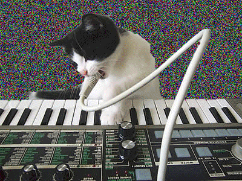

So far we've been dealing with buttons and switches. These are binary inputs, either they're **ON** or **OFF**, **OPEN** or **CLOSED**. As we've seen, depending on how they're wired, they can set the digital IO pins to **HIGH** or **LOW** voltage.

Analog inputs measure a range of voltage levels, not just HIGH and LOW. They're called analog pins because the level of the voltage is analogous to some other property. For instance, a pressure sensor might output an increasing voltage under increased pressure.

On the UNO, there are 6 analog inputs:

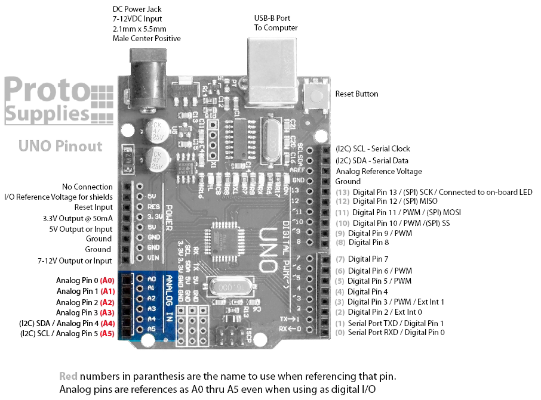

These read from 0 - 5 volts only (DO NOT EXCEED THIS RANGE!).

The UNO will map the 0 - 5 volts to an integer with 10-bits of precision, from 0 - 1024 ( 2^10 or `pow(2,10)` )

## Remember Ohm's Law?

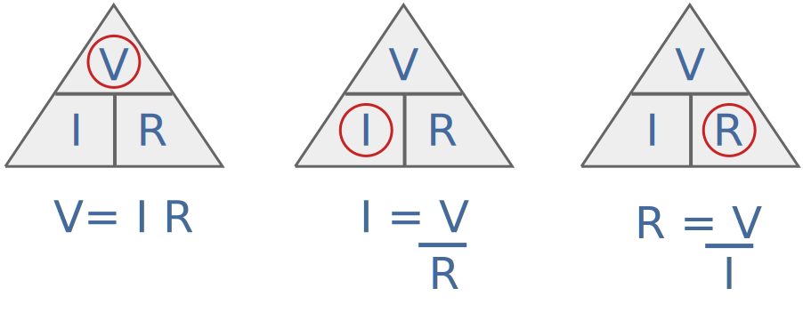

* **I** - current in Amperes (Amps), A
* **R** - resistance in Ohms, Ω
* **V** - voltage Volts, v

We can couple this with [Kirchhoffs Circuit Laws](https://www.electronics-tutorials.ws/dccircuits/dcp_4.html) to analyze circuits. It's important to know this so you can select the right components and debug your circuits.

## Kirchhoff's Laws

Let's get some terminology down first:

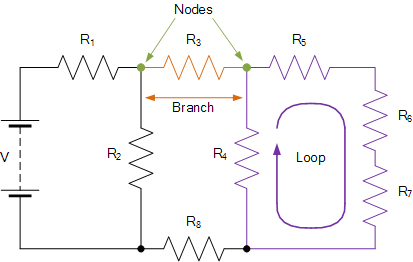

* **nodes** - the intersection of branches
* **branch** - distinct paths for current
* **loop** - closed a path for current

### Kirchhoff's First Law – The Current Law, (KCL) AKA Conservation of Charge

* The total current entering a node is equal to the current leaving the node.

In other words, the sum of ALL the currents entering and leaving a node equals zero, I(exiting) + I(entering) = 0.

### Kirchhoff's Second Law – The Voltage Law, (KVL) AKA Conservation of Energy

* In any closed loop network, the total voltage around the loop is equal to the sum of all the voltage drops within the same loop” which is also equal to zero.

In other words the algebraic sum of all voltages within the loop must be equal to zero.

## Circuit Analysis

### Simple

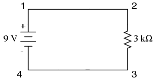

* What is the current flowing through the resistor?
* What's the voltage drop across the resistor?

### Series

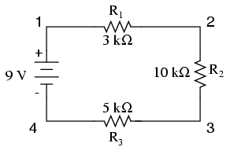

* What is the current flowing through the resistor R1?
* What is the current flowing through the resistor R3?
* What's the voltage drop across each resistor?

## Voltage Dividers

### Schematic:


### Formula:


## Potentiometers

### Photo:

This a basic potentiometer. It consists of a material inside that has a variable resistance along its length. A wiper connected to the shaft makes contact with this material.

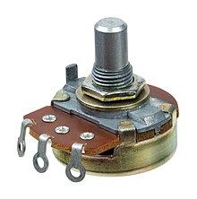

### Schematic Symbol:


### Pinout Diagram:

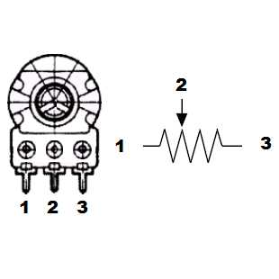

The resistance between pins 1 and 3 is always fixed. The resistance between pin 2 and either pin 1 or pin 3 depends on the rotation of the shaft.

This look mighty familiar though...

## [`analogRead()`](https://www.arduino.cc/reference/en/language/functions/analog-io/analogread/)

When reading from **digital IO** pins, on the arduino, we have to specify in the `setup()` what their `pinMode()` is. This is NOT the case with analog inputs.

All we need to do in order to read an analog pin is call `analogRead()` and supply is with the pin number: A0-A5 (UNO)

Consider the code from the AnalogInput example built into Arduino's IDE:

```
int sensorPin = A0;    // input pin for the potentiometer
int ledPin = 13;      // pin for the LED
int sensorValue = 0;  // store the value coming from the sensor

void setup() {
  pinMode(ledPin, OUTPUT);
}

void loop() {

  sensorValue = analogRead(sensorPin);

  digitalWrite(ledPin, HIGH);

  delay(sensorValue);

  digitalWrite(ledPin, LOW);

  delay(sensorValue);
}
```

What is this code doing?

## Analog Outputs: PWM


(most) Arduino boards do not have built in Digital to Analog converters. But they do have the ability to precisely control the timing of on and off signals.

### Pulses and Rectangle/Square Waves

A pulse is a momentary change in the output of a digital pin from LOW to HIGH.

When pulses arrive at a constant rate or frequency, the produce a pulse wave or rectangle wave. A square wave is a special case of rectangle wave where the duty cycle is 50% on 50% off.

### Duty Cycle and Frequency

If the rate of our pulse stream is fast enough, we can control the duty cycle to achieve effects like dimming an LED or controlling the speed of a DC motor.

With a fast enough frequency and some filtering, you can even [produce audio](https://create.arduino.cc/projecthub/106958/pwm-sound-synthesis-9596f0). This is also the idea behind [Class-D amplifiers](https://en.wikipedia.org/wiki/Class-D_amplifier)

## [analogWrite()](https://www.arduino.cc/reference/en/language/functions/analog-io/analogwrite/)

`analogWrite()` uses the PWM output capabilities of the Arduino microprocessors. Each board has specific pins that support PWM output.

* UNO PWM Pins: `3, 5, 6, 9, 10, 11`
* PWM Frequencies: 490 Hz (pins 5 and 6: 980 Hz)

### Usage:

`analogWrite(pin, value)`

* pin - type `int`
* value - type `int`, 0 (off) - 255 (on)
	
```
int ledPin = 9;      // LED connected to digital pin 9
int analogPin = 3;   // potentiometer connected to analog pin 3
int val = 0;         // variable to store the read value

void setup() {
  pinMode(ledPin, OUTPUT);  // sets the pin as output
}

void loop() {
  val = analogRead(analogPin);  // read the input pin
  analogWrite(ledPin, val / 4); // analogRead values go from 0 to 1023, analogWrite values from 0 to 255
}
```

## In-Class Exercises

* use a potentiometer to turn on and off an LED
* devise a way to prevent flickering at the threshold


## Libraries: [CapacitiveSensor](https://playground.arduino.cc/Main/CapacitiveSensor/)

Capacitors are a component that stores charge between two parallel plates. The schematic symbol is


### Installing the Library

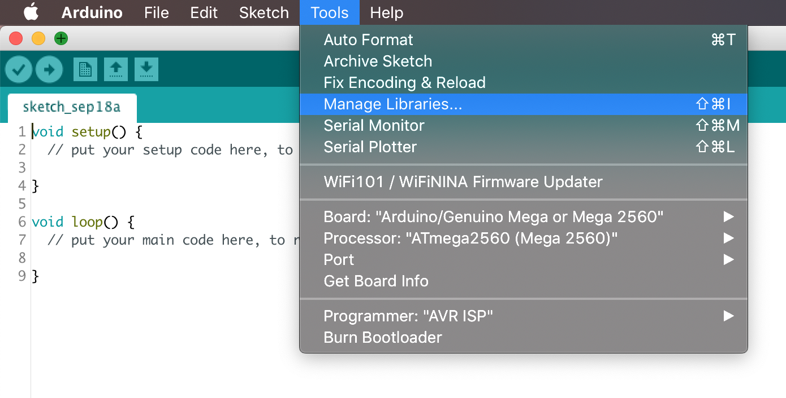

Search for `capacitive` and click install once you find `CapacitiveSensor`

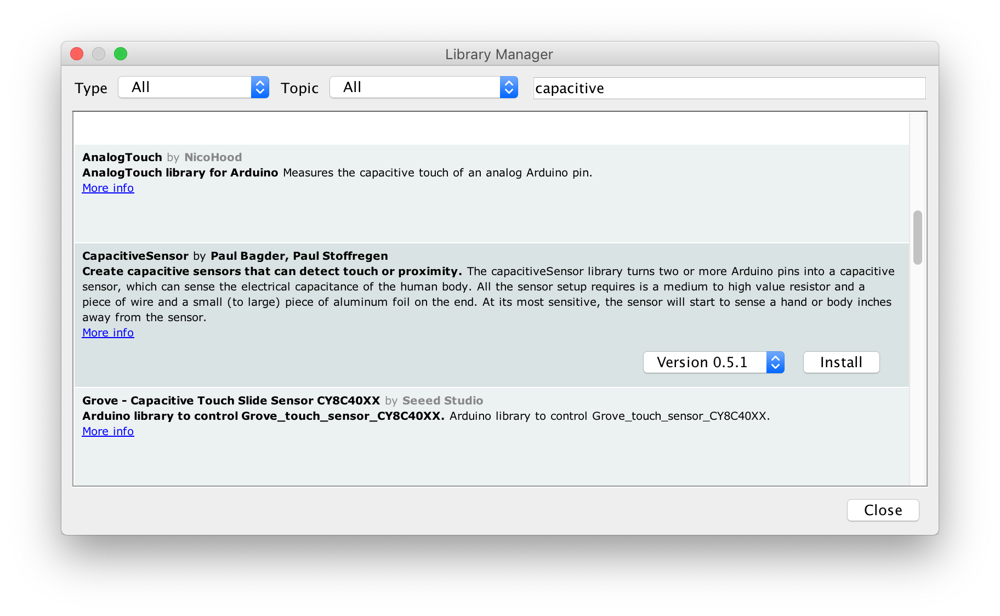

### Loading the Example

Examples from included and custom libraries can be found in `File > Examples >`

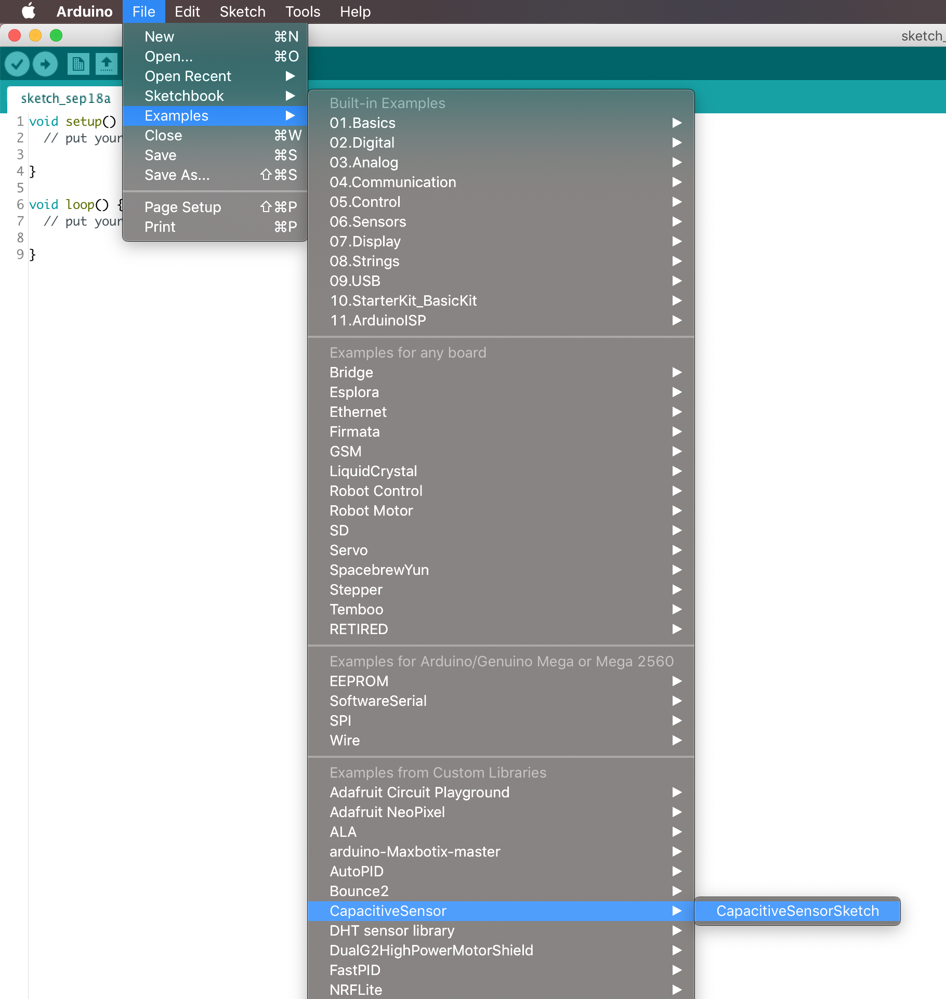

See the documentation for a detailed explanation of the code:

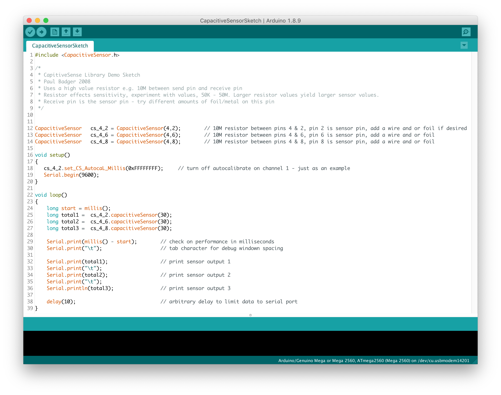

Try to figure out what it's doing!

### [Simplified Code](https://github.com/phillipdavidstearns/PGTE_5585_F2019/blob/master/notes/week4/arduino/CapacitiveSensorDemo/CapacitiveSensorDemo.ino)

```
#include <CapacitiveSensor.h>

/*
 * CapitiveSense Library Demo Sketch
 * Paul Badger 2008
 * Uses a high value resistor e.g. 10M between send pin and receive pin
 * Resistor effects sensitivity, experiment with values, 50K - 50M. Larger resistor values yield larger sensor values.
 * Receive pin is the sensor pin - try different amounts of foil/metal on this pin
 * 
 * Modified by Phillip David Stearns for PGTE_5585_F2019
 * 
 */

CapacitiveSensor   cs_4_2 = CapacitiveSensor(4,2);        // 10M resistor between pins 4 & 2, pin 2 is sensor pin, add a wire and or foil if desired

void setup()                    
{
   cs_4_2.reset_CS_AutoCal();
   cs_4_2.set_CS_AutocaL_Millis(0xFFFFFFFF);     // turn off autocalibrate on channel 1 - just as an example
   Serial.begin(9600);
}

void loop()                    
{
    long start = millis();
    long total1 =  cs_4_2.capacitiveSensor(10);

    Serial.print(millis() - start);        // check on performance in milliseconds
    Serial.print("\t");                    // tab character for debug windown spacing

    Serial.println(total1);                  // print sensor output 1

    delay(250);                             // arbitrary delay to limit data to serial port 
}
```

### Wiring it up

This image comes from the [Capacitive Sensing Library](https://playground.arduino.cc/Main/CapacitiveSensor/) page on the [Arduino Playground](https://playground.arduino.cc/).

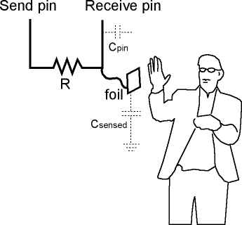

* Resistor - I used a 1M Ohm resistor, but it definitely seems like the bigger, the better!

### Serial Monitor


The serial monitor gives us a way to send more detailed human readable messages to help us debug the hardware.

## In-Class Exercises

* Get into your groups
* Wire up the Capacitive Example
* Use the capacitive sensor to:
	* toggle an led
	* change the brightness of an LED

## Assignment

### Experiment with different forms of analog inputs to control LED behaviors. 

* Design some LED indicators
	* button presses
	* analog sensors
		* capacitive
		* pressure
		* flex
		* potentimeter
	* multiple LEDs
		* on/off, dimming and blinking

For Example:

1. Use a potentiometer to change the rate of a blinking LED
2. Use capacitive sensing library to indicate when someone is near
3. Use touch as an interaction with an object, space etc
4. Change the brightness of an LED based on how close or far someone is.

You can increase the number of touch inputs and/or you can play around with the number and type of outputs.

### Journal Entry: Based on Discussions

### Group 1 Research Presentation: Design Principles and Methodologies